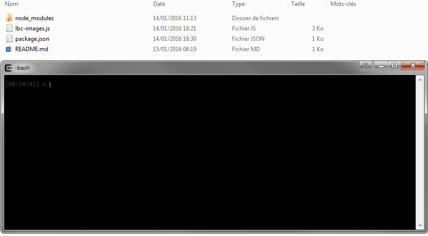

Ce script permet de télécharger toutes les images d'une annonce du site [leboncoin.fr](http://leboncoin.fr).

Il est en JavaScript et fonctionne avec Node.js.

# Installation

Vous devez avoir [Node.js](nodejs.org) installé sur votre machine.

Téléchargez l'archive du script ou clonez le dépôt.

Lancez un terminal (ou invite de commande) et positionnez-vous dans le répertoire du script puis faites cette commande pour installer les dépendances :

	npm install

# Utilisation

L'utilisation du script est très basique :

	node lbc-images.js URL-DE-L-ANNONCE-LBC

Le dernier paramètre correspond à l'adresse Internet de l'annonce sur le site.

Par défaut, le script créé un répertoire "images" pour y déposer les photos récupérées. Vous pouvez changer ce nom via le paramètre `directory` présent en début de script.

